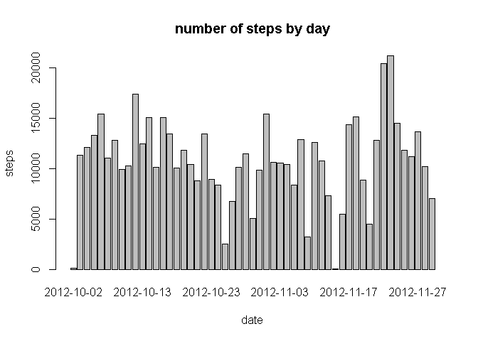

# Reproducible Research: Peer Assessment 1


## Loading and preprocessing the data

```r
setwd("~/RepData_PeerAssessment1")
activity <- read.csv("~/RepData_PeerAssessment1/activity.csv", as.is=TRUE)
```
##1. Make a histogram of the total number of steps taken each day

```r
byday<-aggregate(steps~date, activity, sum)
barplot(height=byday$steps, names.arg=byday$date, xlab="date", ylab='steps', main='number f steps by day')
```

 

## What is mean total number of steps taken per day?

```r
byday<-aggregate(steps~date, data= activity, sum)


## What is the average daily activity pattern?


## Imputing missing values


## Are there differences in activity patterns between weekdays and weekends?
```
